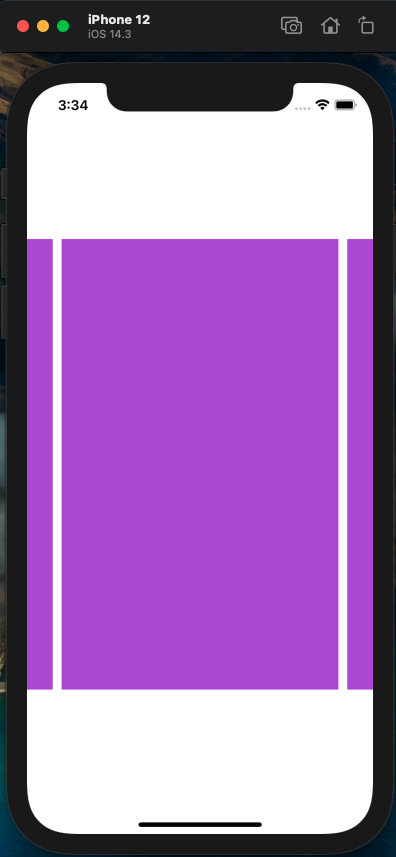

# PagerView - A ViewPager example Implementation of IOS!

This project demonstrate how animation like view pager can be implemented with collection view IOS.

# Features:

 - Dynamically set cell view in the centre of the screen.
 - Automatic focus to nearest cell when scroll/ drag ended.

# Steps and pseudocode:

 1. Implement basic horizontal UICollectionView cell.
 2. For focus animation override UITableViewCell where used:
 
  
 ```Swift
 
 extension UICollectionView {
    func scrollToNearestVisibleCollectionViewCell() {
        self.decelerationRate = UIScrollView.DecelerationRate.fast
        let visibleCenterPositionOfScrollView = Float(self.contentOffset.x + (self.bounds.size.width / 2))
        var closestCellIndex = -1
        var closestDistance: Float = .greatestFiniteMagnitude
        for i in 0..<self.visibleCells.count {
            let cell = self.visibleCells[i]
            let cellWidth = cell.bounds.size.width
            let cellCenter = Float(cell.frame.origin.x + cellWidth / 2)

            // Now calculate closest cell
            let distance: Float = fabsf(visibleCenterPositionOfScrollView - cellCenter)
            if distance < closestDistance {
                closestDistance = distance
                closestCellIndex = self.indexPath(for: cell)!.row
            }
        }
        if closestCellIndex != -1 {
            self.scrollToItem(at: IndexPath(row: closestCellIndex, section: 0), at: .centeredHorizontally, animated: true)
        }
    }
}
 
 
 
 ```
 
 3. Add UICollectionViewDataSource, UICollectionViewDelegateFlowLayout, UIScrollViewDelegate as extension:
 
 ```Swift
 extension ViewController:UICollectionViewDataSource, UICollectionViewDelegateFlowLayout, UIScrollViewDelegate{
    
    func collectionView(_ collectionView: UICollectionView, numberOfItemsInSection section: Int) -> Int {
        10
    }
    
    func collectionView(_ collectionView: UICollectionView, cellForItemAt indexPath: IndexPath) -> UICollectionViewCell {
        return collectionView.dequeueReusableCell(withReuseIdentifier: "CustomCollectionViewCell", for: indexPath)
    }
    func collectionView(_ collectionView: UICollectionView, layout collectionViewLayout: UICollectionViewLayout, sizeForItemAt indexPath: IndexPath) -> CGSize {
        CGSize(width: UIScreen.main.bounds.width * cellScaleWidth, height: UIScreen.main.bounds.height * cellScaleHeight)
    }
    func collectionView(_ collectionView: UICollectionView, layout collectionViewLayout: UICollectionViewLayout, insetForSectionAt section: Int) -> UIEdgeInsets {
        
        return UIEdgeInsets(top: 0, left: insetX!, bottom: 0, right: insetX!)
    }
    
    func scrollViewDidEndDecelerating(_ scrollView: UIScrollView) {
        self.collection_view.scrollToNearestVisibleCollectionViewCell()
    }
    func scrollViewDidEndDragging(_ scrollView: UIScrollView, willDecelerate decelerate: Bool) {
        if !decelerate {
            self.collection_view.scrollToNearestVisibleCollectionViewCell()
        }
    }
    
    
}

 
 ```

 
  4. Do not forget to write code in viewDidLoad() method - 
  
  ```Swift
  
          collection_view.dataSource = self
          collection_view.delegate = self
  
  
  ```
  
   # Demo Video: 
 
 [](https://www.youtube.com/watch?v=n6-0D1r_1mM&list=PLLw6OLk_lXHrMfxlTY8fKYTBW1oTRSI6O)
  
